持续更新中.......

# AI部署

本项目是[AICore](https://github.com/FelixFu520/AICore)项目的扩展，主要是将AICore中的模型部署到以下所有平台上

[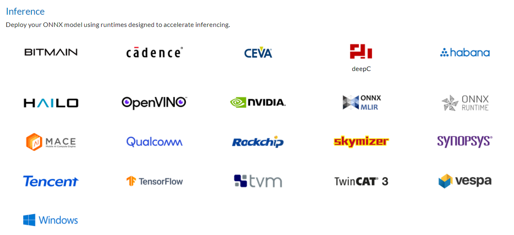](https://onnx.ai/supported-tools.html)

部署过程要考虑**硬件架构**、**系统版本**、**加速设备(GPU,CPU,...)**、**框架**、**编程语言** ，因此将所有情况整理成如下表格，

| ID   | Arch | Platform               | API        | FrameWork(Hardware Acceleration) | 项目目录                  |
| ---- | ---- | ---------------------- | ---------- | -------------------------------- | ------------------------- |
| 01   | x86  | Ubuntu18.04+           | C++ 11     | onnxruntime1.11.0(cpu)           |                           |
| 02   | x86  | Windows10              | C++11      | onnxruntime1.11.0(cpu)           | OnnxRuntimeWindowsCPP     |
| 03   | x86  | Windows10/Ubuntu18.04+ | Python3.6+ | onnxruntime1.11.0(cpu)           | OnnxRuntimeWinlinuxPython |
| 🍓    |      |                        |            |                                  |                           |
| 07   | x86  | Ubuntu18.04+           | C++ 11     | tensorrt8.2(gpu)                 |                           |
| 08   | x86  | Windows10              | C++ 11     | tensorrt8.2(gpu)                 | OnnxRuntimeWindowsCPP     |
| 09   | x86  | Windows10/Ubuntu18.04+ | Python3.6+ | tensorrt8.2(gpu)                 |                           |
| 🍒    |      |                        |            |                                  |                           |

**注意**

- 其中Windows开发环境以VS工程备份在百度云，linux环境备份成Docker镜像。
- 本工程并未将tensorrt、onnxruntime等加速框架合并成一个库，而是分成多个库，方便以后调试

## 1. AICore Model支持列表

## 2. 环境安装

### 2.1 OnnxRuntime(windows)

本文是x86、windows10、C++库制作过程

[安装环境时参考官方](https://www.onnxruntime.ai/docs/how-to/install.html)

**注意**：不管是GPU版本，还是CPU版本，请先确定CUDA、OnnxRuntime版本，[参考](https://onnxruntime.ai/docs/install/)

#### 2.1.1 GPU版本

**最新版本的onnxruntime可能不支持，所以以下内容仅供参考**

##### (1)、VS2017安装

略

##### (2)、VS2017新建项目

##### (3)、安装onnxruntime

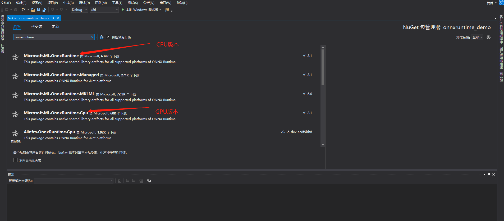

##### (4)、 配置opencv

安装略，因为测试过程中需要opencv，所以需要安装

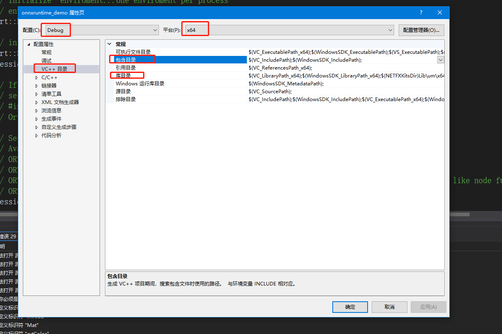

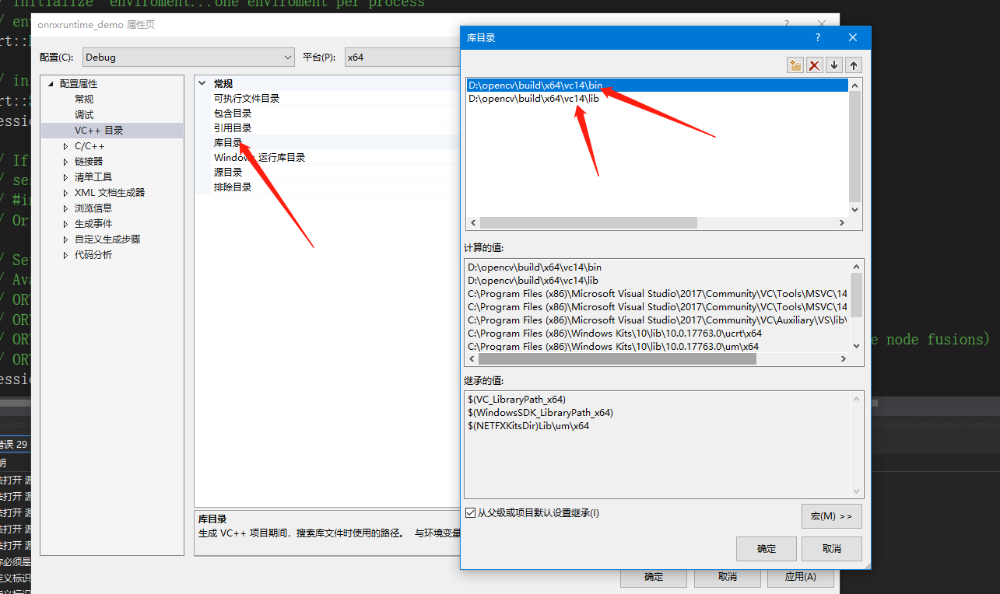

注意：**一定要做好版本匹配**

#### 2.2 CPU版本

##### (1). VS2017安装

略

##### (2). VS2017新建项目

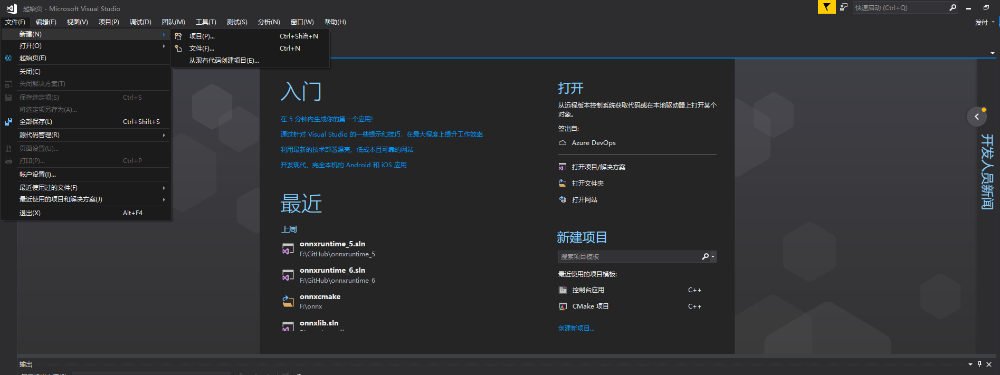

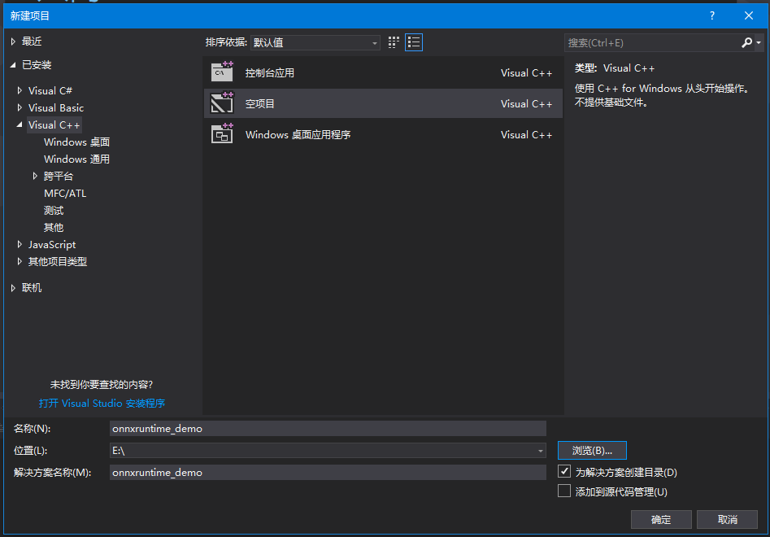

##### (3). 安装onnxruntime

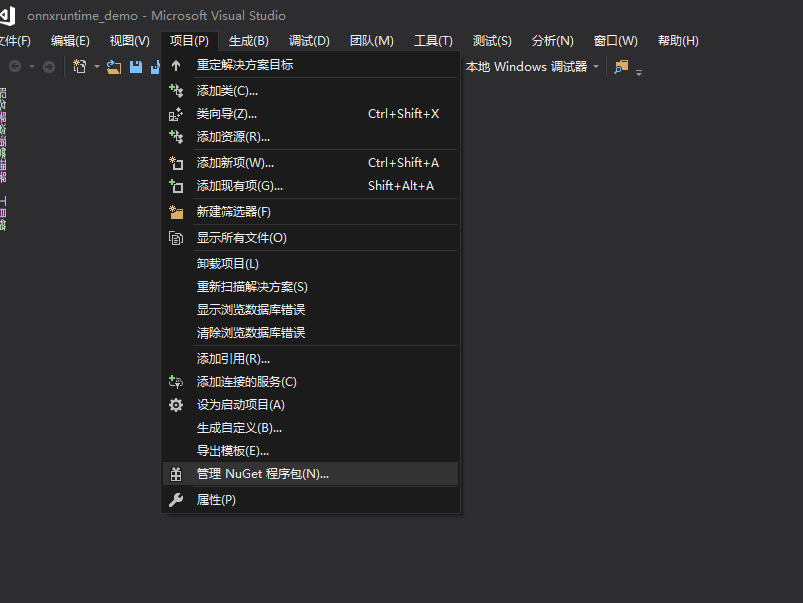

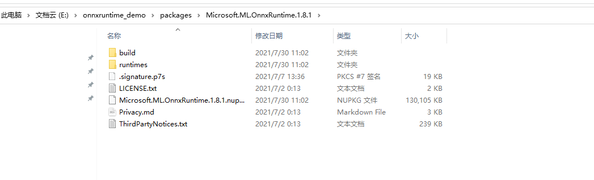

##### (4). 配置opencv

编译安装略

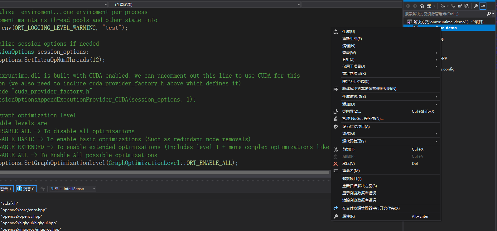

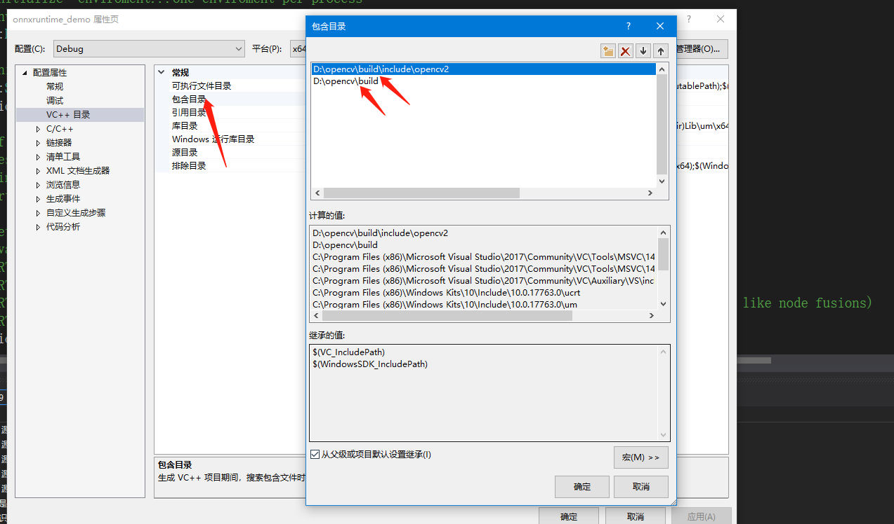

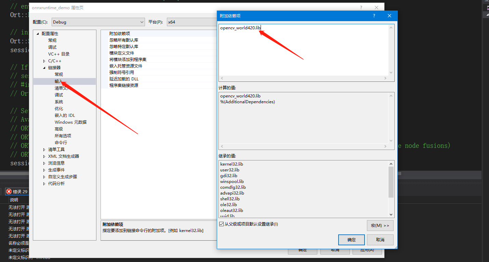

**一定要做好版本匹配**

### 2.2 TensorRT(windows)

[安装环境时参考官方](https://www.onnxruntime.ai/docs/how-to/install.html)

**注意**：请先确定CUDA、TensorRT版本，[参考](https://onnxruntime.ai/docs/install/)

#### (1) opencv安装

略，参考onnxruntime如何安装的

#### (2) 安装TensorRT

[自己总结](https://github.com/FelixFu520/README/blob/main/envs/tools/tensorrt_win10.md)

#### (3)  VS环境配置

##### 1）创建解决方案

##### 2) 为TensorRTLib项目添加include、lib、dll等配置

##### 3）为Demo项目配置include、lib、dll等

## 参考博客

#### 1. ONNXRuntime

- [参考博客1](https://zhuanlan.zhihu.com/p/414317269)

- ONNXRuntime官方资料

  - [1] [onnxruntime官网学习资料](https://onnxruntime.ai/)

  - [2] [onnxruntime Tutorial](https://onnxruntime.ai/docs/)

  - [3] [onnxruntime-gpu和cuda版本对应](https://onnxruntime.ai/docs/install/#requirements)

  - [4] [onnxruntime-openmp](https://pypi.org/project/onnxruntime-openmp/)

  - [5] [onnxruntime和cuda之间的版本对应-很详细](https://onnxruntime.ai/docs/execution-providers/CUDA-ExecutionProvider.html)
  - [6] [onnxruntime与onnx各opset的对应](https://github.com/microsoft/onnxruntime/blob/master/docs/Versioning.md)
  - [7] [lite.ai.toolkit](https://github.com/AICoreRef/lite.ai.toolkit)

- Onnxruntime-C++参考

  - [1] [onnx_runtime_cpp-github](https://github.com/AICoreRef/onnx_runtime_cpp) *
  - [2] [onnxruntime demo2](https://github.com/AICoreRef/onnxruntime_cpp_demo) *
  - [3] [onnxruntime demo3](https://github.com/AICoreRef/onnxruntime-demo) *
  - [4] [onnxruntime demo4](https://github.com/AICoreRef/DeepModelDeploy) *

  - [2] [onnxruntime的c++使用](https://blog.csdn.net/baidu_34595620/article/details/112176278) *

  - [7] [onnxruntime-c++多输入多数出case](https://github.com/microsoft/onnxruntime/blob/master/onnxruntime/test/shared_lib/test_inference.cc)

  - [8] [onnxruntime中传入特定数据类型，比如fp16,int8](https://blog.csdn.net/znsoft/article/details/114583048)

- [onnxruntime调用AI模型的python和C++编程](https://blog.csdn.net/XCCCCZ/article/details/110356437)

- [解决: ONNXRuntime(Python) GPU 部署配置记录](https://zhuanlan.zhihu.com/p/457484536)
- [C++ log项目](https://github.com/AICoreRef/ylog)

#### 2. TensorRT

#### 3. Numpy(c++)

- 官方资料
  - GitHub：[dpilger26](https://github.com/dpilger26)/[NumCpp](https://github.com/dpilger26/NumCpp)
  - [API](https://dpilger26.github.io/NumCpp/doxygen/html/index.html)

